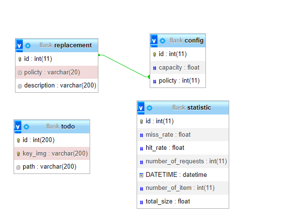
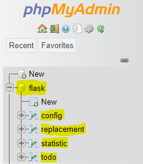
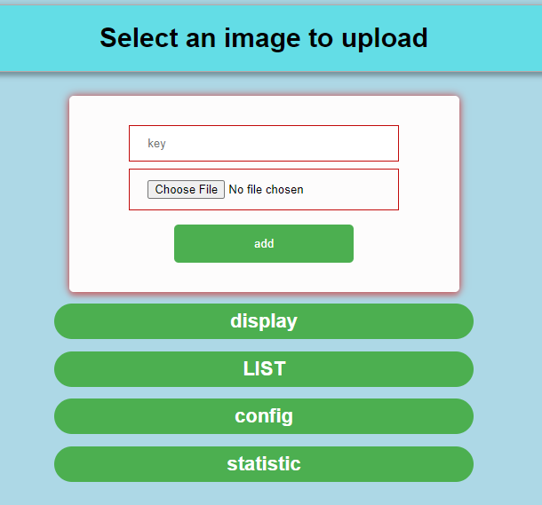

# flask-web-project
# db mysql , db_name = flask

  

# install all the necessary library in python3  
# ( pip3 install -library- )
# run ( python3 main.py ) or ( python main.py )

# About :
<ul>
   <li>Project upload and display images ,and save them in db and memcache</li>
   <li>Images can be modified and removed using their keys (unique keys)</li>
   <li>The keys can saved in memcache by replacement policty 1-random 2-LRU replacement</li>
  <li> You can specify the cache size in MB </li>
  <li> the program can save the statistic of every request in 5s and display statistic every 10 minutes </li>
  </ul>

#   (:
